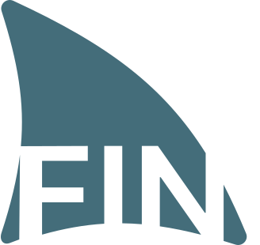

	

# FIN
Fin is a statically typed language that aims to be simple enough to write basic scripts in, and powerful enough to maintain bigger codebases in. 

## Building

The building of FIN is handled through a Python script

Ensure that ldc2 and Python are installed on your system.

